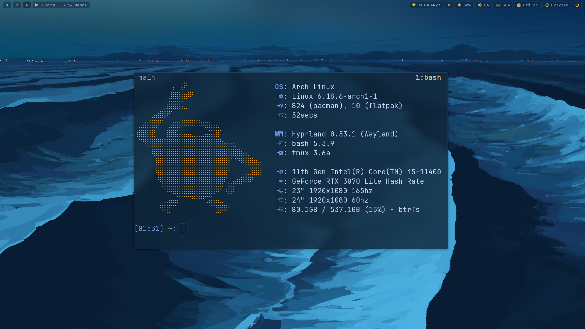
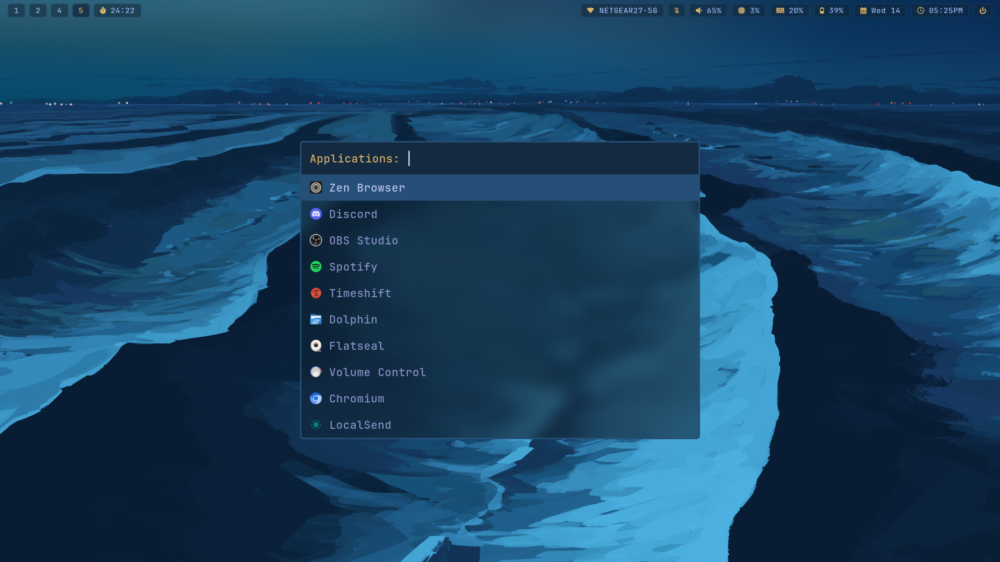
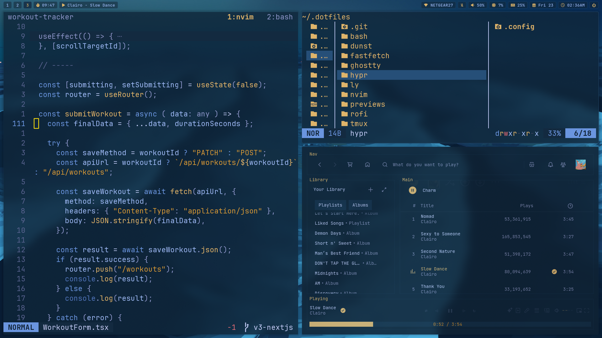
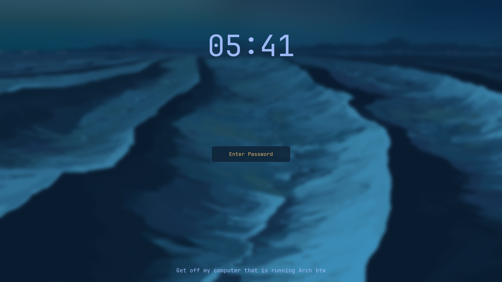

# I use arch btw

Everything uses my custom blue and gold colorscheme, based off my keycaps.



<div align="center">
  
  
  
</div>

---

> Everything below here is for if I need to install again. If you are a stranger, hi, and don't randomly install my config. This isn't a guide.

## Setup stuff:

Get paru or yay.

GNU Stow for managing config files:

```
paru -S stow
```

Install dotfiles:

```
git clone https://github.com/laoz40/.dotfiles.git
cd .dotfiles
```

stow + directory name to make symlink:
```
# e.g. nvim
stow nvim

# all
stow .
```

## Stuff I use:

Essential stuff:

- **Neovim**: `neovim`
- **tmux**: `tmux`
    - tmux-sessionizer
- **Ghostty**: `ghostty`
- **Lazygit**: `lazygit`
- **Yazi**: `yazi`
- **Zoxide**: `zoxide`
- **fzf**: `fzf`
- **Zen Browser**: `zen-browser-bin` (AUR)
    - Betterfox

```
paru -S neovim tmux ghostty lazygit yazi zoxide fzf zen-browser-bin
```

Linux stuff and other stuff:

- **hyprland**: `hyprland`
- **hyprpaper**: `hyprpaper`
- **hyprlock**: `hyprlock`
- **hypridle**: `hypridle`
- **hyprshot**: `hyprshot`
- **hyprpicker**: `hyprpicker`
- **rofi**: `rofi`
- **waybar**: `waybar`
- **dunst**: `dunst`
- **fastfetch**: `fastfetch`
- **WezTerm** (for Windows)

```
paru -S hyprland hyprpaper hyprlock hypridle hyprshot hyprpicker rofi waybar dunst fastfetch
```

System stuff:

- **ly**: `ly`
- **Network Manager**: `networkmanager`
- **pavucontrol**: `pavucontrol`
- **blueman** (if bluetooth): `blueman`
- **mpris**: `playerctl`
- **btop**: `btop`
- **cliphist**: `cliphist`
- **QView**: `qview` (AUR)
- **mpv**: `mpv`
- **TLP** (for laptop): `tlp`
- Timeshift and GRUB btrfs for backing up and restoring

```
paru -S ly networkmanager pavucontrol playerctl btop cliphist qview mpv
```

Appearance stuff:

- **JetBrains Mono**: `ttf-jetbrains-mono` `ttf-jetbrains-mono-nerd`
- **Bibata cursor**: `bibata-cursor-theme-bin` (AUR)
- **Tela icons**: `tela-icon-theme` (AUR)
- **cmatrix**: `cmatrix`
- **batcat**: `bat`

```
paru -S bibata-cursor-theme-bin tela-icon-theme ttf-jetbrains-mono ttf-jetbrains-mono-nerd cmatrix bat
```

## Enable stuff:

ly Display Manager (Login screen):

```
sudo systemctl enable ly@tty1.service
systemctl disable getty@tty1.service
```

Networking and Bluetooth:

```
sudo systemctl enable --now NetworkManager
sudo systemctl enable --now bluetooth
```

TLP for laptop:

```
sudo systemctl enable tlp.service
```

tmux:
```
git clone https://github.com/tmux-plugins/tpm ~/.tmux/plugins/tpm
```
