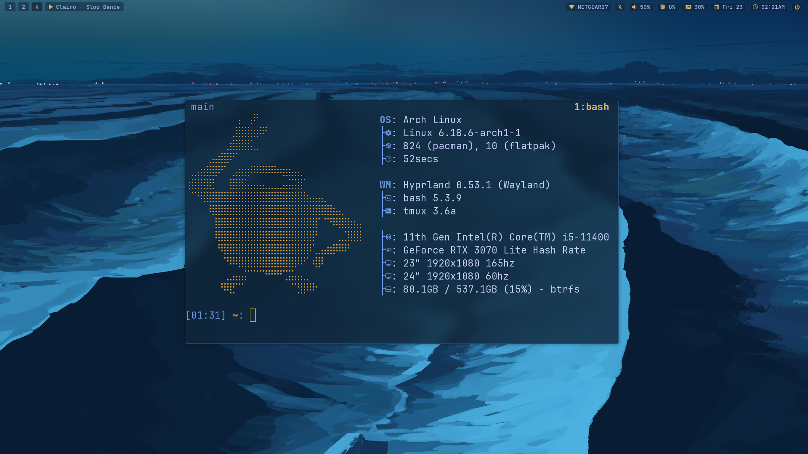
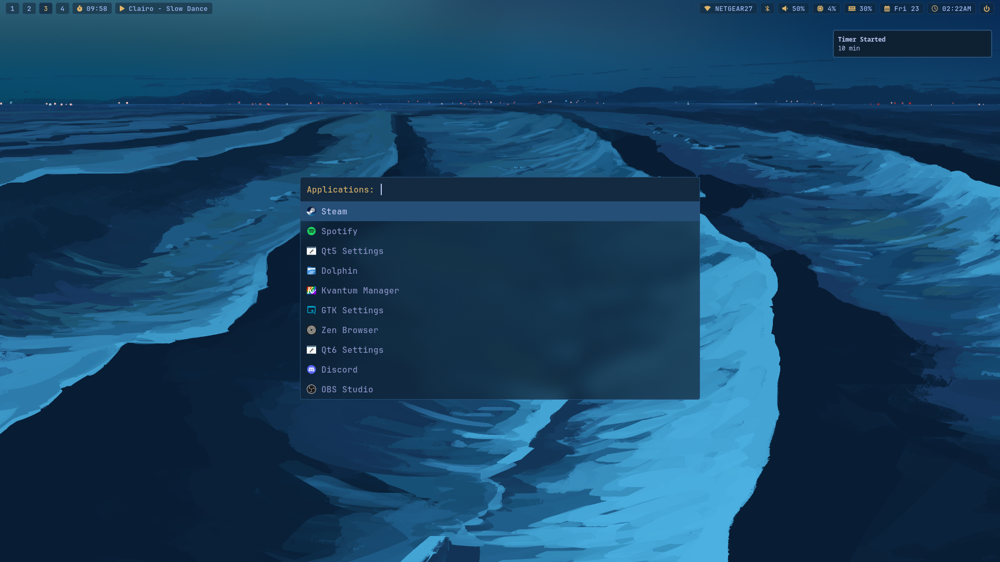
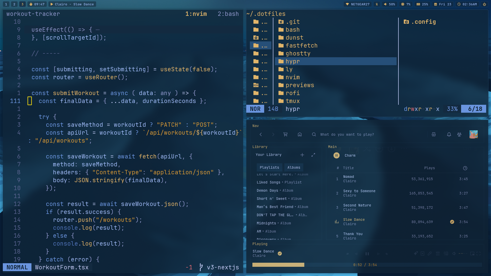

# Leo's configuration files for Linux (arch btw)

Everything uses my custom blue and gold colorscheme, based off my keycaps.



<div align="center">
  
  
  
</div>

---

> Everything below here is for my convenience if I need to install again.

## Setup stuff:

Get paru or yay.

```
sudo pacman -S --needed base-devel && git clone https://aur.archlinux.org/paru.git && cd paru && makepkg -si
```

GNU Stow for managing config files:

```
paru -S stow
```

Install dotfiles:

```
git clone https://github.com/laoz40/.dotfiles.git && cd .dotfiles
```

stow + directory name to make symlink:

```
# e.g. nvim
stow nvim

# all
stow .
```

## Stuff I use:

Essential stuff:

- **Neovim**: `neovim`
- **tmux**: `tmux`
  - [tmux-sessionizer](https://github.com/ThePrimeagen/.dotfiles/blob/master/bin/.local/scripts/tmux-sessionizer)
- **Ghostty**: `ghostty`
- **Lazygit**: `lazygit`
    - [LazyCommit](https://github.com/Hamxter/lazycommit)
- **Yazi**: `yazi`
- **Zoxide**: `zoxide`
- **fzf**: `fzf`
- **Zen Browser**: `zen-browser-bin` (AUR)
  - [Betterfox](https://github.com/yokoffing/BetterFox)

```
paru -S neovim tmux ghostty lazygit yazi zoxide fzf zen-browser-bin
```

Linux stuff and other stuff:

- **hyprlock**: `hyprlock`
- **hypridle**: `hypridle`
- **hyprshot**: `hyprshot`
- **hyprpicker**: `hyprpicker`
- **rofi**: `rofi`
    - **rofi-emoji**: `rofi-emoji noto-fonts-emoji`
    - **networkmanager-dmenu**: `networkmanager-dmenu`
- **waybar**: `waybar`
- **dunst**: `dunst`
- **fastfetch**: `fastfetch`

```
paru -S hyprland hyprpaper hyprlock hypridle hyprshot hyprpicker rofi rofi-emoji noto-fonts-emoji networkmanager-dmenu waybar dunst fastfetch
```

System stuff:

- **ly**: `ly`
- **Network Manager**: `networkmanager`
- **pavucontrol**: `pavucontrol`
- **blueman** (if bluetooth): `blueman`
- **mpris**: `playerctl`
- **btop**: `btop`
- **cliphist**: `cliphist`
- **QView**: `qview` (AUR)
- **mpv**: `mpv`
- ** GNOME Keyring**: `gnome-keyring`
- **TLP** (for laptop): `tlp`
- **brightnessctl** (for laptop): `brightnessctl`
- **Timeshift**: `timeshift`
  - **Timeshift-autosnap**: `timeshift-autosnap`
  - **Grub-btrfs**: `grub-btrfs`
  - **Inotify-tools**: `inotify-tools`

```
paru -S ly networkmanager pavucontrol playerctl btop cliphist qview mpv gnome-keyring timeshift timeshift-autosnap grub-btrfs inotify-tools
```

Appearance stuff:

- **JetBrains Mono**: `ttf-jetbrains-mono` `ttf-jetbrains-mono-nerd`
- **cmatrix**: `cmatrix`
- **batcat**: `bat`
- **Bibata cursor**: `bibata-cursor-theme-bin` (AUR)
- **Arc-theme**: `arc-gtk-theme` (AUR)
  - **nwg-look**: `nwg-look`
  - **qt**: `qt5ct` `qt6ct` (AUR)
  - **kvantum**: `kvantum` `kvantum-qt5` (AUR)

```
paru -S ttf-jetbrains-mono ttf-jetbrains-mono-nerd cmatrix bat bibata-cursor-theme-bin arc-gtk-theme nwg-look qt5ct qt6ct kvantum kvantum-qt5
```

## Enable stuff:

ly Display Manager (Login screen):

```
sudo systemctl enable ly@tty1.service
systemctl disable getty@tty1.service
```

Networking and Bluetooth:

```
sudo systemctl enable --now NetworkManager
sudo systemctl enable --now bluetooth
```

TLP for laptop:

```
sudo systemctl enable tlp.service
```

tmux:

```
git clone https://github.com/tmux-plugins/tpm ~/.tmux/plugins/tpm
```

Timeshift + grub-btrfs:

```
sudo /etc/grub.d/41_snapshots-btrfs
grub-mkconfig -o /boot/grub/grub.cfg
sudo systemctl start grub-btrfsd
sudo systemctl enable grub-btrfsd
sudo systemctl edit --full grub-btrfsd
sudo systemctl restart grub-btrfsd
```
