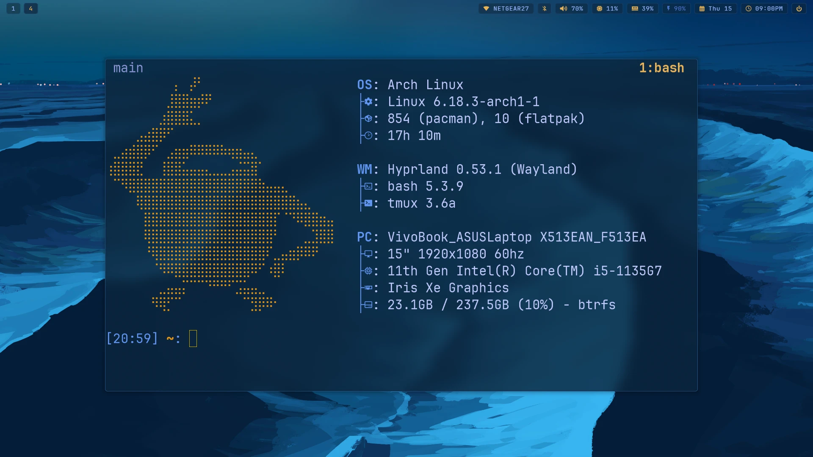
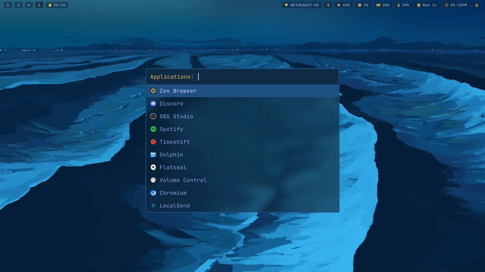
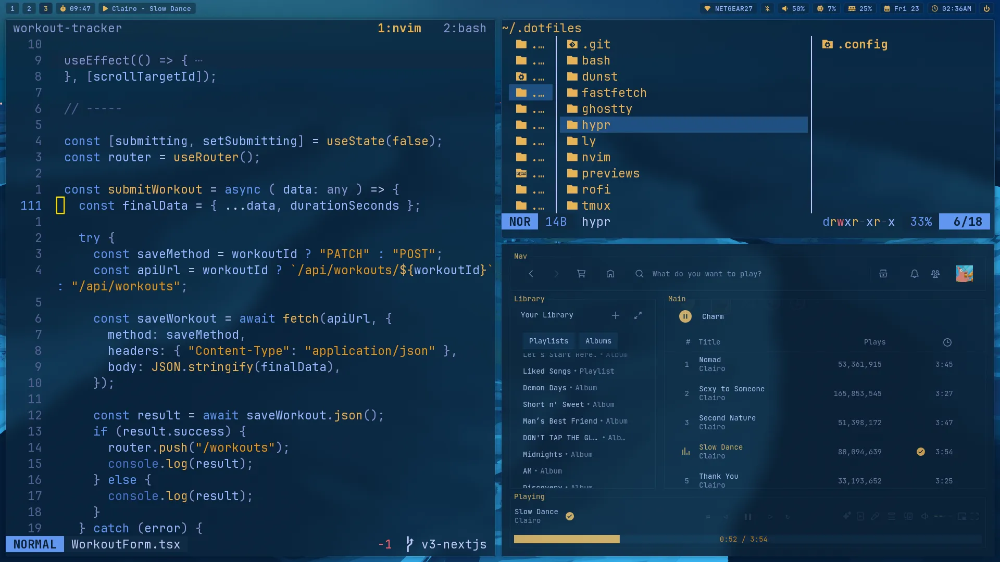
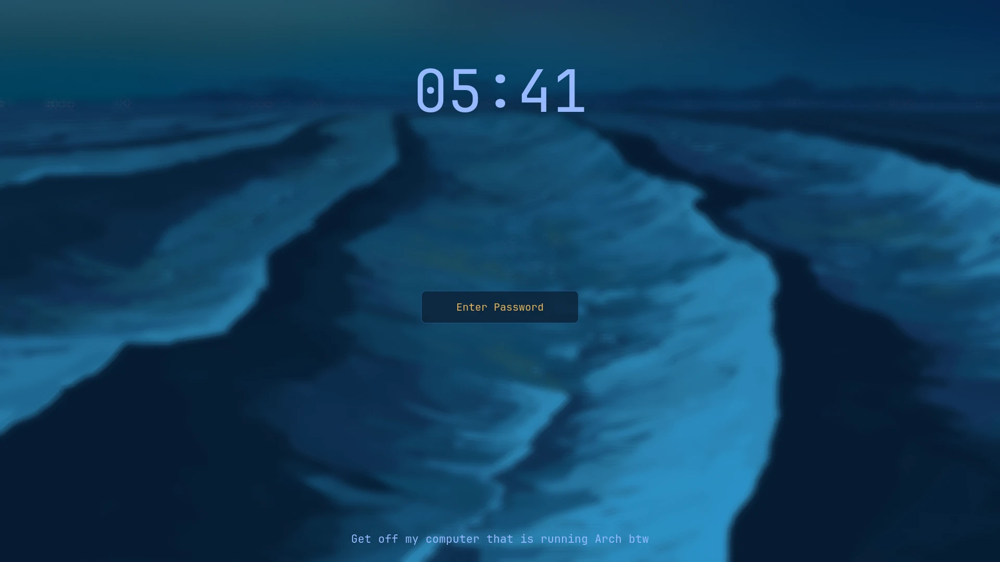

# Leo's configuration files for Linux (arch btw)

Everything uses my custom blue and gold colorscheme, based off my keycaps.



<div align="center">
  
  
  
</div>

---

> Everything below here is for my convenience if I need to install again.

## Setup

Install [Nix](https://nixos.org/download/), then enable flakes:

```bash
mkdir -p ~/.config/nix
printf 'experimental-features = nix-command flakes\n' >> ~/.config/nix/nix.conf
```

Clone the dotfiles:

```bash
git clone https://github.com/laoz40/.dotfiles.git ~/.dotfiles
cd ~/.dotfiles
```

Apply the standalone Home Manager flake for the first time:

```bash
nix run home-manager/master -- switch --flake .#leoz
```

After Home Manager is installed, apply later changes with:

```bash
home-manager switch --flake ~/.dotfiles#leoz
```

Home Manager installs the programs declared in [`home.nix`](./home.nix), configures Zsh, Git, GTK/Qt, and links the managed configuration files from this repository into `$HOME`. Some application configs use out-of-store symlinks so edits take effect directly, while others are copied into the Nix store and require another `home-manager switch`.

The Hyprland main/minimal visuals can be switched at runtime with `hypr-profile-toggle.sh`.

## Stuff I use:

Essential stuff:

- **Neovim**: `neovim`
- **Herdr**: `herdr`
- **tmux**: `tmux`
- **Ghostty**: `ghostty`
- **Lazygit**: `lazygit`
- **Pi**: `pi-coding-agent`
  - **RTK**: `rtk`
- **Yazi**: `yazi`
  - **trash-cli**: `trash-cli` for Yazi trash restore plugin
- **Zoxide**: `zoxide`
- **fzf**: `fzf`
- **Zsh**: `zsh`
  - **Autosuggestions**: `zsh-autosuggestions`
  - **Syntax highlighting**: `zsh-syntax-highlighting`
- **Pass**: `pass`
- **Zen Browser**: `zen-browser-bin` (AUR)
  - [Betterfox](https://github.com/yokoffing/BetterFox)

Linux stuff and other stuff:

- **hyprlock**: `hyprlock`
- **hypridle**: `hypridle`
- **hyprsunset**: `hyprsunset`
- **hyprshot**: `hyprshot`
    -**satty**: `satty`
- **hyprpicker**: `hyprpicker`
- **hyprwhspr**: `hyprwhspr` (AUR)
- **rofi**: `rofi`
    - **rofi-emoji**: `rofi-emoji noto-fonts-emoji`
    - **rofi-calc**: `rofi-calc`
    - **networkmanager-dmenu**: `rofi-network-manager`
- **waybar**: `waybar`
- **dunst**: `dunst`
- **fastfetch**: `fastfetch`
- **onefetch**: `onefetch`

System stuff:

- **ly**: `ly`
- **Network Manager**: `networkmanager`
- **pavucontrol**: `pavucontrol`
- **blueman** (if bluetooth): `blueman`
- **mpris**: `playerctl`
- **btop**: `btop`
- **cliphist**: `cliphist`
- **QView**: `qview`
- **mpv**: `mpv`
- ** GNOME Keyring**: `gnome-keyring`
- **TLP** (for laptop): `tlp`
- **brightnessctl** (for laptop): `brightnessctl`
- **Timeshift**: `timeshift`
  - **Timeshift-autosnap**: `timeshift-autosnap`
  - **Grub-btrfs**: `grub-btrfs`
  - **Inotify-tools**: `inotify-tools`

Appearance stuff:

- **JetBrains Mono**: `ttf-jetbrains-mono` `ttf-jetbrains-mono-nerd`
- **cmatrix**: `cmatrix`
- **batcat**: `bat`
- **Bibata cursor**: `bibata-cursor-theme-bin`
- **Arc-theme**: `arc-gtk-theme`
  - **qt**: `qt5ct` `qt6ct`
  - **kvantum**: `kvantum` `kvantum-qt5`

## Enable stuff:

ly Display Manager (Login screen):

```
sudo systemctl enable ly@tty1.service
systemctl disable getty@tty1.service
```

Networking and Bluetooth:

```
sudo systemctl enable --now NetworkManager
sudo systemctl enable --now bluetooth
```

TLP for laptop:

```
sudo systemctl enable tlp.service
```

tmux:

```
git clone https://github.com/tmux-plugins/tpm ~/.tmux/plugins/tpm
```

Timeshift + grub-btrfs:

```
sudo /etc/grub.d/41_snapshots-btrfs
grub-mkconfig -o /boot/grub/grub.cfg
sudo systemctl start grub-btrfsd
sudo systemctl enable grub-btrfsd
sudo systemctl edit --full grub-btrfsd
sudo systemctl restart grub-btrfsd
```

## Shell scripts:

| Script | What it does |
| --- | --- |
| `herdr-sessionizer.sh` | Pick a folder with fzf and focus or create a Herdr workspace for it. |
| `hypr-profile-toggle.sh` | Toggle between main and minimal Hyprland/Waybar/Rofi/Ghostty profiles. |
| `ocr-screenshot.sh` | Select a screen region, OCR it with Tesseract, and copy the text to the clipboard. From [Screen-Text-Reader](https://github.com/TheBrightSoul/Screen-Text-Reader). |
| `privacy_dots.sh` | Report microphone, camera, location, and screen-share status for privacy indicators. From [privacy-dots](https://github.com/alvaniss/privacy-dots). |
| `ram-alert.sh` | Monitor RAM usage and send alerts or Waybar JSON when usage is high. |
| `rofi_cliphist.sh` | Browse, copy, delete, or clear cliphist clipboard entries with Rofi. |
| `rofi_define.sh` | Look up a word definition from a Rofi prompt and show it in a notification. |
| `rofi_power_menu.sh` | Show a Rofi power menu for shutdown, reboot, sleep, and lock. |
| `rofi_wallpaper.sh` | Pick or randomize a wallpaper and set it with hyprpaper. |
| `rofi_waybar_timer.sh` | Start, pause, cancel, or snooze a timer shown in Waybar. |
| `start-dev-server.sh` | Detect a JS project package manager and start its dev server, with Herdr/tmux splits for Convex. |
| `t3code-wt-switcher.sh` | Pick and cd into a t3 worktree for the current git project. |
| `tmux_sessionizer.sh` | Pick a folder with fzf and switch to or create a tmux session for it. From [tmux-sessionizer](https://github.com/ThePrimeagen/.dotfiles/blob/master/bin/.local/scripts/tmux-sessionizer). |
| `toggle_mic.sh` | Toggle the default microphone mute state and output Waybar status JSON. |
| `waybar_workspace_windows.sh` | Show open windows for the active Hyprland workspace in Waybar. |
